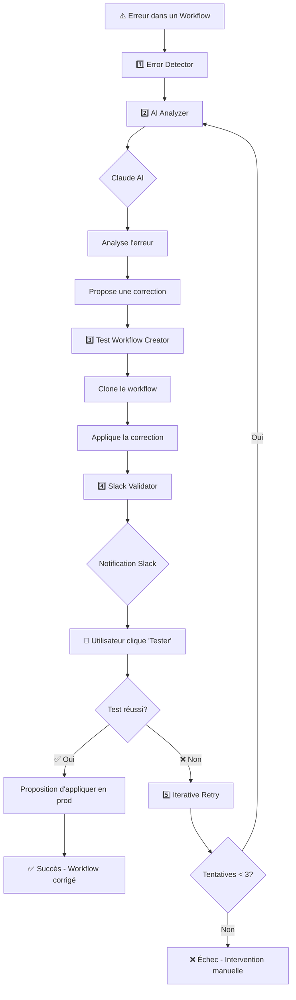

# 🤖 AI Workflow Doctor

> Système d'auto-réparation intelligent pour workflows n8n utilisant Claude AI

## 🎯 Vue d'Ensemble

**AI Workflow Doctor** est un système complet de 5 workflows interconnectés qui détecte, analyse et corrige automatiquement les erreurs dans vos workflows n8n avec l'aide de l'IA Claude d'Anthropic.

### ✨ Fonctionnalités Principales

- 🔍 **Détection automatique** des erreurs dans tous vos workflows
- 🧠 **Analyse IA** des causes racines avec Claude
- 🔧 **Corrections intelligentes** basées sur les best practices n8n
- 🧪 **Tests sécurisés** sur des copies avant application en production
- 💬 **Validation humaine** via Slack avec boutons interactifs
- 🔄 **Retry automatique** jusqu'à 3 tentatives avec apprentissage
- 📊 **Traçabilité complète** de toutes les interventions

---

## 📁 Structure du Projet

```
workflows/
├── 03-test-workflow-creator.json    # Workflow 3: Création et test des corrections
├── 04-slack-validator.json          # Workflow 4: Validation Slack interactive
├── 05-iterative-retry.json          # Workflow 5: Boucle de retry intelligente
├── INSTALLATION-GUIDE.md            # Guide d'installation détaillé
└── README.md                        # Ce fichier
```

### Workflows Déjà Créés sur Votre n8n

| # | Nom | ID | Statut |
|---|-----|-----|--------|
| 1️⃣ | 🚨 AI Doctor - Error Detector | `0hWei4DBPRQGXZy6` | ✅ Créé |
| 2️⃣ | 🤖 AI Doctor - AI Analyzer | `9qx6wAyScMXl1God` | ✅ Créé |

### Workflows à Importer

| # | Nom | Fichier | Action |
|---|-----|---------|--------|
| 3️⃣ | 🧪 AI Doctor - Test Workflow Creator | `03-test-workflow-creator.json` | 📥 À importer |
| 4️⃣ | 📨 AI Doctor - Slack Validator | `04-slack-validator.json` | 📥 À importer |
| 5️⃣ | 🔄 AI Doctor - Iterative Retry | `05-iterative-retry.json` | 📥 À importer |

---

## 🔄 Architecture et Flux de Données



---

## 🚀 Démarrage Rapide

### Prérequis

- ✅ n8n version 1.0+ installé et fonctionnel
- ✅ Clé API n8n activée ([voir doc](https://docs.n8n.io/api/))
- ✅ Compte Anthropic avec clé API ([inscription](https://console.anthropic.com/))
- ✅ Slack Workspace avec droits d'installation d'app ([optionnel mais recommandé](https://api.slack.com/))

### Installation en 5 Étapes

1. **📥 Importer les workflows** (fichiers JSON dans n8n)
2. **🔑 Configurer les credentials** (n8n API, Claude API, Slack)
3. **🔗 Connecter les workflows** (remplacer les placeholders d'IDs)
4. **✅ Activer les workflows** (dans l'ordre: 5→4→3→2→1)
5. **🧪 Tester le système** (créer une erreur volontaire)

**👉 Guide détaillé**: Consultez [INSTALLATION-GUIDE.md](./INSTALLATION-GUIDE.md)

---

## 📊 Détails des Workflows

### 1️⃣ Error Detector
**Rôle**: Point d'entrée du système
**Trigger**: Erreur dans n'importe quel workflow
**Actions**:
- Capture les détails de l'erreur (workflow, node, message, stack trace)
- Extrait le contexte d'exécution
- Lance l'AI Analyzer

**Nodes**: 5 nodes
**Créé**: ✅ ID `0hWei4DBPRQGXZy6`

---

### 2️⃣ AI Analyzer
**Rôle**: Cerveau du système - Analyse IA
**Trigger**: Appelé par Error Detector
**Actions**:
- Récupère le workflow complet via API n8n
- Récupère l'historique des exécutions réussies
- Construit un prompt expert pour Claude
- Envoie à Claude API pour analyse
- Parse la réponse JSON structurée
- Lance le Test Workflow Creator

**Nodes**: 9 nodes
**Créé**: ✅ ID `9qx6wAyScMXl1God`

**Configuration requise**:
- Credential: `n8n API Key` (HTTP Header Auth)
- Credential: `Anthropic API Key` (HTTP Header Auth)

---

### 3️⃣ Test Workflow Creator
**Rôle**: Création sécurisée de workflow de test
**Trigger**: Appelé par AI Analyzer
**Actions**:
- Clone le workflow problématique
- Ajoute suffix `[AI-FIX-TEST-vX]` au nom
- Applique les corrections suggérées par Claude
- Ajoute notes de traçabilité aux nodes modifiés
- Prépare le message Slack formaté
- Lance le Slack Validator

**Nodes**: 8 nodes
**Fichier**: `03-test-workflow-creator.json`

**Configuration requise**:
- Credential: `n8n API Key`
- Placeholder: `PLACEHOLDER_SLACK_VALIDATOR_ID` → ID du workflow 4

---

### 4️⃣ Slack Validator
**Rôle**: Interface de validation utilisateur
**Trigger**: Appelé par Test Workflow Creator + Webhook Slack
**Actions**:
- Envoie notification Slack formatée avec boutons
- Écoute les réponses utilisateur (webhook)
- **Si "Tester" cliqué**:
  - Active le workflow de test
  - Exécute le workflow
  - Vérifie le résultat
  - Si succès → propose application en prod
  - Si échec → lance Iterative Retry
- **Si "Rejeter" cliqué**:
  - Supprime le workflow de test
  - Notifie le rejet

**Nodes**: 17 nodes
**Fichier**: `04-slack-validator.json`

**Configuration requise**:
- Credential: `n8n API Key`
- URL: `PLACEHOLDER_SLACK_WEBHOOK_URL` → Votre webhook Slack
- Placeholder: `PLACEHOLDER_ITERATIVE_RETRY_ID` → ID du workflow 5
- Configuration Slack App: Request URL du webhook

---

### 5️⃣ Iterative Retry
**Rôle**: Boucle d'amélioration continue
**Trigger**: Appelé par Slack Validator si test échoué
**Actions**:
- Vérifie le nombre de tentatives (max 3)
- Récupère les détails de l'échec
- Construit un contexte enrichi avec historique
- Explique à Claude pourquoi la précédente correction a échoué
- Relance l'AI Analyzer avec ce contexte
- Continue jusqu'à succès ou max retries

**Nodes**: 6 nodes
**Fichier**: `05-iterative-retry.json`

**Configuration requise**:
- Credential: `n8n API Key`
- Placeholder: `PLACEHOLDER_AI_ANALYZER_ID` → `9qx6wAyScMXl1God`

---

## 🔐 Sécurité

### Principes de Sécurité Appliqués

✅ **Jamais de modification directe en production**
→ Toujours création d'une copie de test d'abord

✅ **Validation humaine obligatoire**
→ L'IA propose, l'humain décide

✅ **Traçabilité complète**
→ Toutes les modifications sont notées dans les nodes

✅ **Backups automatiques**
→ Version originale toujours préservée

✅ **Rollback facile**
→ Via le système de versions de n8n

✅ **Credentials sécurisées**
→ Utilisation du système de credentials n8n

✅ **Logs d'audit**
→ Toutes les exécutions sont enregistrées

### Avertissement Important

⚠️ **NE JAMAIS** définir Error Detector comme error workflow global sur des workflows critiques sans avoir testé le système d'abord.

⚠️ **TOUJOURS** tester en environnement de développement avant production.

⚠️ **LIMITER** l'accès aux credentials API n8n aux utilisateurs de confiance.

---

## 📈 Métriques et KPIs

### Métriques à Suivre

| Métrique | Description | Objectif |
|----------|-------------|----------|
| **Taux de détection** | % d'erreurs capturées | 100% |
| **Taux de succès IA** | % de corrections réussies au 1er essai | >70% |
| **Temps moyen de correction** | De la détection à la validation | <10 min |
| **Nombre de retries moyens** | Tentatives avant succès | <1.5 |
| **Taux d'approbation humaine** | % de corrections validées | >80% |

### Dashboard Recommandé

Créez un workflow de monitoring qui agrège:
- Erreurs détectées par jour/semaine
- Top 5 des workflows les plus problématiques
- Graphique du taux de succès IA au fil du temps
- Temps de réponse moyen de validation utilisateur

---

## 🔧 Personnalisation

### Adapter le Prompt Claude

Pour améliorer les analyses selon votre contexte:

**Workflow 2 → Node "Build AI Prompt"**

```javascript
// Ajoutez vos règles spécifiques
const systemPrompt = `Tu es un expert n8n...

RÈGLES SPÉCIFIQUES À NOTRE ENVIRONNEMENT:
- Tous nos workflows utilisent PostgreSQL pour la persistence
- Nous utilisons OAuth 2.0 pour toutes les APIs externes
- Nos conventions de nommage: snake_case pour variables, PascalCase pour nodes
- Toujours utiliser des try/catch dans les Code nodes
- Timeout par défaut: 60 secondes pour HTTP Requests

...`;
```

### Ajouter des Patterns Personnalisés

Créez un fichier `custom-patterns.json` avec vos patterns récurrents:

```json
{
  "patterns": [
    {
      "name": "API Rate Limiting",
      "description": "Gestion du rate limiting sur APIs externes",
      "solution": "Ajouter Wait node avec backoff exponentiel"
    },
    {
      "name": "Database Deadlock",
      "description": "Deadlock sur PostgreSQL",
      "solution": "Implémenter retry avec random jitter"
    }
  ]
}
```

Puis incluez-les dans le prompt Claude.

### Notifications Personnalisées

Modifiez le formatage Slack dans **Workflow 3 → Node "Prepare Slack Message"** pour:
- Changer les couleurs selon la gravité
- Ajouter des mentions (@user) pour certains types d'erreurs
- Inclure des liens vers votre documentation interne
- Ajouter des GIFs ou emojis personnalisés

---

## 🧪 Tests et Validation

### Scénarios de Test Recommandés

1. **Test Simple**: Erreur HTTP 404
   - Créer un workflow avec URL invalide
   - Vérifier que le système détecte et propose une correction

2. **Test Complexe**: Erreur de transformation JSON
   - Workflow avec JSONPath incorrect
   - Vérifier que Claude identifie l'erreur de syntaxe

3. **Test Retry**: Correction incomplète
   - Forcer une première correction qui échoue
   - Vérifier que le retry améliore la correction

4. **Test Rejet**: Validation humaine négative
   - Rejeter une correction proposée
   - Vérifier que le workflow de test est supprimé

5. **Test Limite**: Max retries atteint
   - Créer une erreur complexe impossible à corriger
   - Vérifier que le système s'arrête après 3 tentatives

### Checklist de Validation

- [ ] Tous les workflows sont importés
- [ ] Toutes les credentials sont configurées
- [ ] Tous les placeholders d'IDs sont remplacés
- [ ] Slack webhook fonctionne (test avec curl)
- [ ] Slack interactivity est configurée
- [ ] Claude API répond (test dans AI Analyzer)
- [ ] n8n API fonctionne (test dans Error Detector)
- [ ] Les 5 workflows sont activés
- [ ] Un test end-to-end a été réalisé avec succès

---

## 📚 Ressources

### Documentation Officielle

- **n8n**: https://docs.n8n.io
- **Claude API**: https://docs.anthropic.com/claude/reference/
- **Slack API**: https://api.slack.com/docs

### Documentation Locale

- [INSTALLATION-GUIDE.md](./INSTALLATION-GUIDE.md) - Guide d'installation pas à pas
- [CLAUDE.md](../CLAUDE.md) - Configuration de l'expert consultant n8n

### Communauté n8n

- Forum: https://community.n8n.io
- Discord: https://discord.gg/n8n
- GitHub: https://github.com/n8n-io/n8n

---

## 🤝 Support et Contribution

### Besoin d'Aide?

1. Consultez [INSTALLATION-GUIDE.md](./INSTALLATION-GUIDE.md)
2. Vérifiez les logs d'exécution dans n8n
3. Testez chaque workflow individuellement
4. Posez votre question sur le forum n8n

### Améliorations Possibles

- [ ] Ajouter support pour GPT-4 en alternative à Claude
- [ ] Créer un dashboard de monitoring dédié
- [ ] Implémenter un système de learning des corrections
- [ ] Ajouter support pour Microsoft Teams en alternative à Slack
- [ ] Créer une interface web pour gérer les corrections en attente
- [ ] Intégrer avec un système de ticketing (Jira, Linear)

---

## 📄 Licence et Crédits

**Créé par**: Expert Consultant n8n (Claude AI)
**Date**: 2026-02-04
**Version**: 1.0.0

**Technologies utilisées**:
- n8n (Workflow Automation)
- Claude 3.5 Sonnet (Anthropic AI)
- Slack (Notifications)
- n8n API (Automation)

**Basé sur**:
- [n8n-mcp](https://github.com/czlonkowski/n8n-mcp) par Romuald Członkowski
- [n8n-skills](https://github.com/czlonkowski/n8n-skills) par Romuald Członkowski

---

## ⚡ Démarrer Maintenant

**Prêt à installer ?**

```bash
# 1. Ouvrir n8n
# 2. Importer les 3 workflows JSON
# 3. Suivre INSTALLATION-GUIDE.md
# 4. Activer les workflows
# 5. Tester avec une erreur volontaire
```

**👉 Guide complet**: [INSTALLATION-GUIDE.md](./INSTALLATION-GUIDE.md)

---

**🎉 Profitez de votre système d'auto-réparation intelligent !**
